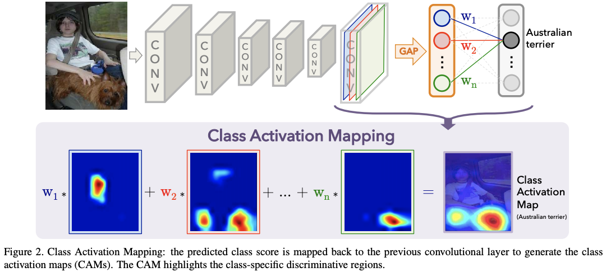
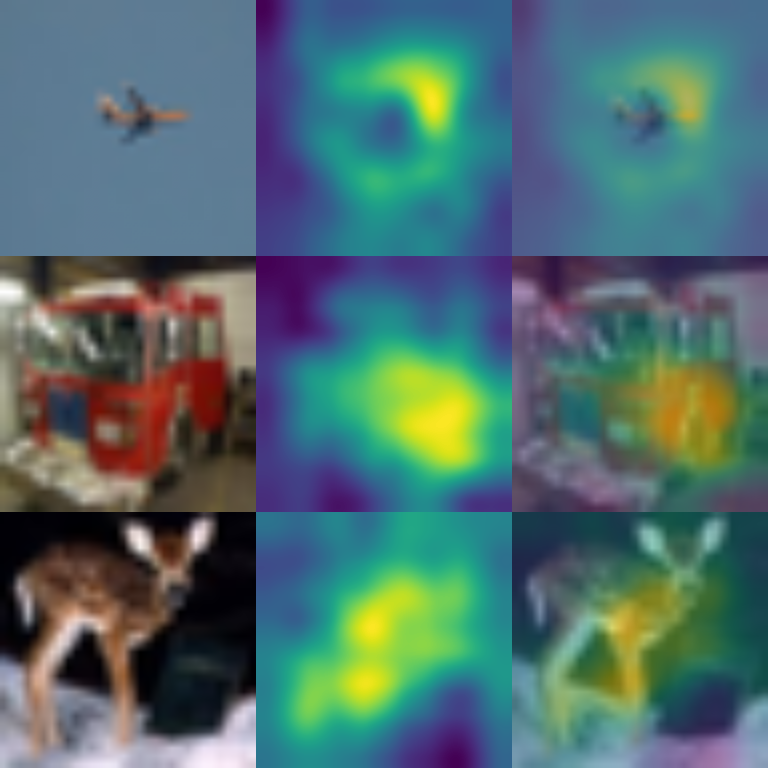
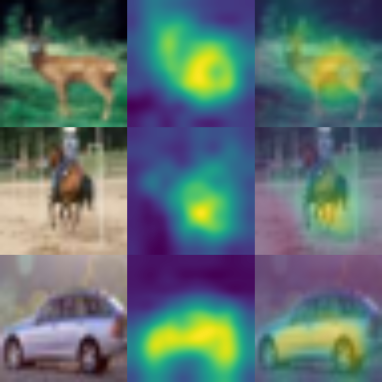
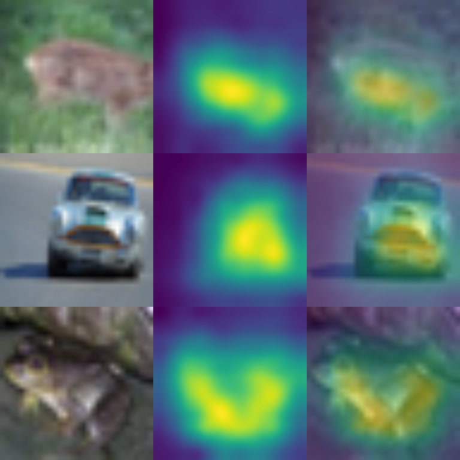

# Cam series with Pytorch

## Requirements

* python 3.x
* pytorch >= 0.4
* pillow
* numpy
* opencv


## How to use

### Train model

Example
```
python3 src/main.py \
        --mode train \
        --model_path './model.pt' \
        --weight_path './<path of save dir that you want>' \
        --data_path 'data/' \
        --batch_size 32 \
        --image_size 256 \
        --device mps
```

## Cam

$$
\begin{align}
F_k = \sum_{x,y} f_k (x, y) && \text{GAP of k-th featrue map} \\
S_c = \sum_{k} w^c_k F_k && \text{input of softmax} \\
w^c_k && \text{importance of $F_k$ for class c} \\ 
P_c = \frac{exp(S_c)}{\sum_c{exp(S_c)}} && \text{softmax output of class c} \\
S_c = \sum_k w^c_k F_k = \sum_k w_k \sum_{x,y} f_k(x,y) = \sum_{x,y} \sum_{k}w^c_kf_k(x,y) \\
M_c(x,y) = \sum_k{w_c} f_k(x,y) && \text{CAM (Class Activation Map)}
\end{align}
$$



Example

```
python3 src/main.py \
        --mode cam \
        --model_path 'model.pt' \
        --weight_path 'weights.pt' \
        --data_path 'data/' \
        --batch_size 4 \
        --image_size 256 \
        --device mps
```

## Results
### CAM


### Grad-CAM


### Grad-CAM++


