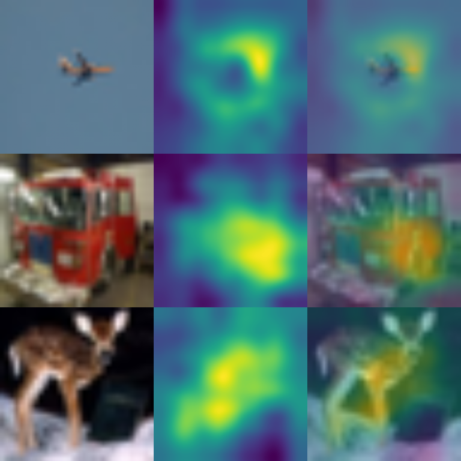
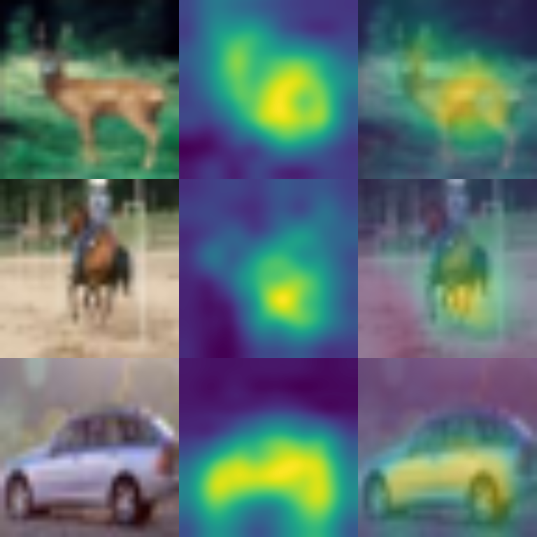
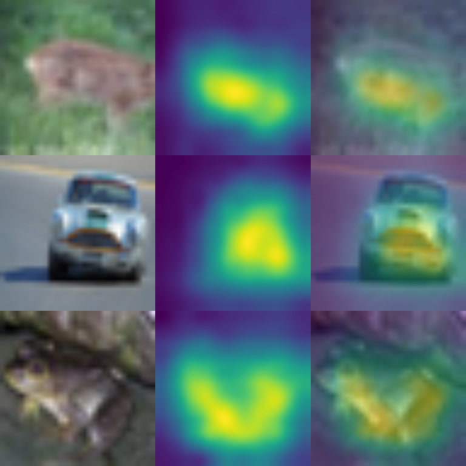

# Cam serise with Pytorch

## Requirements

* python 3.x
* pytorch >= 0.4
* pillow
* numpy
* opencv


## How to use

### Train model

Example
```
python3 src/main.py \
        --mode train \
        --model_path './model.pt' \
        --weight_path './<path of save dir that you want>' \
        --data_path 'data/' \
        --batch_size 32 \
        --image_size 256 \
        --device mps
```

## Cam

Example

```
python3 src/main.py \
        --mode cam \
        --model_path 'model.pt' \
        --weight_path 'weights.pt' \
        --data_path 'data/' \
        --batch_size 4 \
        --image_size 256 \
        --device mps
```

## Results
### CAM


### Grad-CAM


### Grad-CAM++


